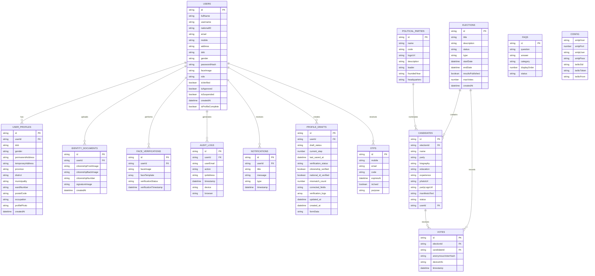

# VoTex Election ER Diagram

## Notes

- The diagram reflects the main MongoDB-style collections used by the app.
- Relationships are logical and align with the current data access layer in [src/db/dbService.ts](src/db/dbService.ts).
- The schema definition for these collections is available in [src/db/schema.ts](src/db/schema.ts).
