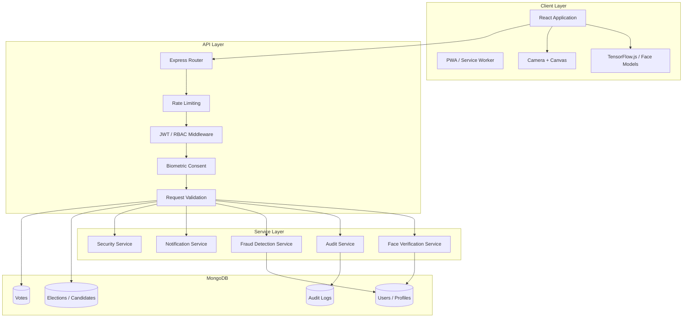

# 🗳️ VoTex — Secure Digital Voting & Biometric Election Management Platform

<div align="center">


### Secure Digital Voting • Identity Verification • Biometric Authentication

**VoTex is a full-stack digital election management platform designed to demonstrate secure voter registration, identity verification, biometric authentication, election management, and controlled digital ballot casting.**

**Author:** [Subhash Sharma](https://github.com/Subhash107k)

</div>

---

## 📌 Overview

**VoTex** is a modern full-stack election platform built around a **secure voter lifecycle**:

```text
Registration
     ↓
Profile Completion
     ↓
Identity / Document Verification
     ↓
Biometric Enrollment
     ↓
Voter Approval
     ↓
Election Eligibility
     ↓
Live Face Verification
     ↓
Ballot Access
     ↓
Vote Submission
     ↓
Vote Receipt + Audit Record
```

The system combines:

* Secure authentication and authorization
* Voter profile management
* Nepali electoral and address information
* Identity-document verification workflows
* Browser-based facial verification
* Liveness-oriented checks
* Election and candidate management
* Controlled ballot casting
* Duplicate-vote prevention
* Administrative approval workflows
* Audit logging
* Notifications
* Responsive voter and administrator interfaces

> **Important:** VoTex is a software project and demonstration platform. It should not be considered certified or ready for deployment in a legally binding public election without independent security audits, accessibility testing, biometric validation, election-security certification, privacy/legal review, infrastructure hardening, and extensive real-world testing.

---

# 📚 Table of Contents

* [Core Objectives](#-core-objectives)
* [Key Features](#-key-features)
* [Voter Journey](#-voter-journey)
* [System Architecture](#-system-architecture)
* [Biometric Verification](#-biometric-verification)
* [Election Workflow](#-election-workflow)
* [Security Architecture](#-security-architecture)
* [Database Design](#-database-design)
* [Project Structure](#-project-structure)
* [Technology Stack](#-technology-stack)
* [Getting Started](#-getting-started)
* [Environment Variables](#-environment-variables)
* [API Reference](#-api-reference)
* [Development Workflow](#-development-workflow)
* [Testing & Verification](#-testing--verification)
* [Production Considerations](#-production-considerations)
* [Viva / Project Defense](#-viva--project-defense)
* [Author](#-author)
* [License](#-license)

---

# 🎯 Core Objectives

VoTex is designed around five major objectives.

### 1. Identity Integrity

Create a structured identity-verification workflow that connects voter information with submitted identity credentials and biometric verification.

### 2. One Voter — One Vote

Prevent duplicate ballots using application-level validation together with database-level uniqueness constraints.

### 3. Secure Election Lifecycle

Allow administrators to control the complete election lifecycle:

```text
Draft
  ↓
Published
  ↓
Open
  ↓
Paused (optional)
  ↓
Closed
  ↓
Finalized
```

### 4. Auditability

Maintain an audit trail for important security-sensitive operations such as:

* Registration
* Login attempts
* Profile changes
* Document review
* Biometric verification
* Election changes
* Vote submission
* Administrative actions

### 5. Usability

Provide a responsive interface that works across:

* Desktop
* Laptop
* Tablet
* Mobile

The interface supports Nepali-oriented address and identity information and is designed with accessibility and clear user feedback in mind.

---

# ✨ Key Features

## 🔐 Authentication & Authorization

* Secure voter registration
* Login/logout
* JWT-based authentication
* Protected API routes
* Role-based access control
* Session validation
* Profile completion workflow
* Password hashing
* Authentication rate limiting

---

## 🪪 Identity & Voter Verification

VoTex supports a structured voter verification process including:

* Citizenship information
* National ID information
* Voter card information
* Personal details
* Address information
* Document uploads
* Profile review
* Administrative approval

### Nepal Address Support

The platform is designed to support hierarchical address information:

```text
Province
   ↓
District
   ↓
Municipality / Rural Municipality
   ↓
Ward
```

The system can also maintain permanent and temporary residence information where required by the application workflow.

---

# 🧑‍💻 Voter Journey

A typical voter workflow is:

### Step 1 — Registration

The voter creates an account and provides the required baseline information.

### Step 2 — Complete Profile

The voter submits:

* Personal information
* Contact information
* Address
* Identity information
* Required documents

### Step 3 — Verification

The submitted information is reviewed according to the configured approval workflow.

### Step 4 — Biometric Enrollment

The voter completes facial enrollment after appropriate consent.

### Step 5 — Election Eligibility

The system checks whether the voter:

* Has an approved profile
* Is eligible for the election
* Has not already voted

### Step 6 — Pre-Vote Face Verification

A live camera capture is compared with the enrolled biometric representation.

### Step 7 — Ballot Access

Only after successful eligibility and verification checks does the voting interface become available.

### Step 8 — Vote Submission

The voter selects the desired candidate/option and submits the ballot.

### Step 9 — Vote Receipt

The system generates a transaction/receipt identifier for the completed voting operation.

---

# 🧬 Biometric Verification

VoTex uses a hybrid browser/server biometric architecture.

```text
Camera
  ↓
Browser Video Stream
  ↓
Face Detection
  ↓
Landmark / Feature Analysis
  ↓
Liveness-Oriented Checks
  ↓
Face Embedding
  ↓
Secure API Request
  ↓
Server Verification
  ↓
Similarity Evaluation
  ↓
Verification Result
```

## Client-Side Processing

The browser performs facial processing using TensorFlow.js and face-analysis models.

The workflow can include:

* Face detection
* Facial landmark analysis
* Face bounding-box validation
* Head orientation checks
* Blink-related checks
* Camera positioning guidance
* Capture-quality validation

## Embedding Comparison

A live embedding can be compared against the enrolled representation using similarity metrics.

For vectors:

[
L = \text{Live Embedding}
]

[
R = \text{Registered Embedding}
]

Cosine similarity:

[
Similarity =
\frac{L \cdot R}
{|L||R|}
]

An additional distance-based score may be calculated:

[
DistanceScore =
\max
\left(
0,
1 -
\sqrt{
\frac{1}{n}
\sum_{i=1}^{n}(L_i-R_i)^2
}
\right)
]

A configurable weighted score can then be used:

[
FinalScore =
0.65(CosineSimilarity)
+
0.35(DistanceScore)
]

The application can compare the resulting score against a configurable threshold.

> **Biometric note:** A threshold such as `0.82` is an application configuration, not a universally valid biometric-security standard. Real deployments require dataset-based threshold calibration, false-acceptance/false-rejection analysis, demographic evaluation, presentation-attack testing, and independent validation.

---

# 🗳️ Election Workflow

Administrators can manage an election through a controlled lifecycle.

```text
Create Election
      ↓
Configure Election
      ↓
Add Candidates
      ↓
Publish Election
      ↓
Open Voting
      ↓
Voters Verify Eligibility
      ↓
Biometric Verification
      ↓
Ballot Casting
      ↓
Voting Closes
      ↓
Results Finalization
```

## Election Management

The administrative system can provide:

* Election creation
* Election editing
* Candidate management
* Voting start/end configuration
* Election status management
* Voter eligibility management
* Voting monitoring
* Result visualization
* Audit history

---

# 👥 Candidate Management

Candidate profiles may contain:

* Candidate name
* Candidate photo
* Party affiliation
* Biography
* Education
* Manifesto
* Campaign information
* Logo/photo assets

Candidate information is presented to voters before ballot submission to support informed decision-making.

---

# 🛡️ Administrative Console

The administration panel provides centralized management of the election system.

### Voter Management

* Pending voter registrations
* Approved voters
* Rejected registrations
* Profile inspection
* Identity-document review
* Verification status

### Election Management

* Create election
* Update election
* Add/remove candidates
* Configure voting periods
* Open/close election
* Pause/resume where supported
* Finalize results

### Monitoring

* Registered voters
* Approved voters
* Voting participation
* Election status
* Verification events
* System activity

### Audit Console

Administrators can inspect security-relevant events including:

* User
* Action
* Timestamp
* Status
* IP metadata
* User-agent metadata
* Relevant resource identifiers

---

# 🏗️ System Architecture



---

# 🔒 Security Architecture

VoTex uses multiple security layers rather than relying on a single mechanism.

## Authentication

Protected API requests require authenticated credentials.

```text
Client
  ↓
Bearer Token
  ↓
JWT Validation
  ↓
User Identity
  ↓
Role Check
  ↓
Protected Resource
```

## Password Security

Passwords should never be stored in plaintext.

The application uses password hashing mechanisms such as bcrypt.

## Request Validation

API payloads should be validated before reaching business logic.

Zod-based schemas can validate:

* Request body
* Parameters
* Query values
* Required fields
* Data formats

## Rate Limiting

Authentication and other sensitive endpoints should be protected against:

* Brute-force attempts
* Excessive requests
* Automated abuse

## Security Headers

Helmet can be used to configure security-related HTTP headers.

---

# 🧾 Vote Integrity

A major requirement is preventing multiple votes from the same voter in the same election.

A database-level uniqueness constraint can be structured conceptually as:

```javascript
{
  userId: 1,
  electionId: 1
}
```

This means that the database rejects another vote for the same:

```text
User + Election
```

combination.

Application-level validation should still be performed before the database operation.

The recommended approach is:

```text
Check Eligibility
       ↓
Check Election Status
       ↓
Check Previous Vote
       ↓
Validate Ballot
       ↓
Atomic Database Operation
       ↓
Create Vote Record
       ↓
Create Audit Event
```

---

# 🗄️ Database Design

The MongoDB layer is conceptually divided into major domains.

### Users / Profiles

Stores:

* Account information
* Profile information
* Verification state
* Biometric enrollment metadata
* Roles
* Eligibility information

### Elections

Stores:

* Election details
* Status
* Voting window
* Election configuration

### Candidates

Stores:

* Candidate profile
* Party
* Manifesto
* Election association

### Votes

Stores:

* Election reference
* Voter reference or privacy-preserving identifier
* Selected option
* Timestamp
* Receipt/hash information
* Relevant audit metadata

### Audit Logs

Stores security-sensitive application events.

---

# 📁 Project Structure

```text
VoTex-Election/
│
├── controllers/
│   ├── auth.controller.ts
│   └── faceVerification.controller.ts
│
├── middleware/
│   ├── audit.middleware.ts
│   ├── biometricConsent.middleware.ts
│   ├── deviceFingerprint.middleware.ts
│   ├── validation.middleware.ts
│   └── verifyFace.ts
│
├── routes/
│   ├── auth.routes.ts
│   ├── faceVerification.routes.ts
│   └── profiles.js
│
├── services/
│   ├── audit.service.ts
│   ├── cache.service.ts
│   ├── faceVerification.service.ts
│   ├── fraudDetection.service.ts
│   ├── notification.service.ts
│   └── security.service.ts
│
├── src/
│   ├── App.tsx
│   ├── main.tsx
│   │
│   ├── components/
│   │   ├── Admin/
│   │   ├── auth/
│   │   ├── common/
│   │   ├── dashboard/
│   │   ├── documents/
│   │   ├── elections/
│   │   ├── face-verification/
│   │   ├── public/
│   │   └── ui/
│   │
│   ├── data/
│   ├── db/
│   │   ├── dbService.ts
│   │   └── schema.ts
│   │
│   ├── hooks/
│   ├── pages/
│   ├── services/
│   └── utils/
│
├── public/
│   └── models/
│
├── server.ts
├── vite.config.ts
├── tsconfig.json
├── package.json
├── .env.example
└── README.md
```

---

# 🛠️ Technology Stack

| Category          | Technology               | Purpose                               |
| ----------------- | ------------------------ | ------------------------------------- |
| Frontend          | React 19                 | User interface                        |
| Language          | TypeScript 5.8           | Type-safe application development     |
| Build Tool        | Vite 6                   | Development and production bundling   |
| Styling           | Tailwind CSS 4           | Responsive UI                         |
| Animation         | Motion                   | UI transitions and micro-interactions |
| Backend           | Node.js + Express        | REST API                              |
| Database          | MongoDB                  | Persistent application data           |
| Biometrics        | Face API / TensorFlow.js | Face detection and feature extraction |
| Validation        | Zod                      | Runtime validation                    |
| Authentication    | JWT                      | API authentication                    |
| Password Security | BcryptJS                 | Password hashing                      |
| Cryptography      | Node Crypto              | Hashing and security utilities        |
| Charts            | Recharts                 | Election analytics                    |
| Notifications     | Nodemailer / Twilio      | Email and SMS                         |
| PWA               | Service Worker           | Progressive web capabilities          |

---

# 🚀 Getting Started

## Prerequisites

Install:

* Node.js 18+
* Node.js 20+ recommended
* npm 9+
* MongoDB
* A working webcam for biometric functionality

Verify Node.js:

```bash
node --version
```

Verify npm:

```bash
npm --version
```

Verify MongoDB connectivity according to your local MongoDB setup.

---

# 📦 Installation

Clone the project:

```bash
git clone https://github.com/Subhash107k/VoTex-Election.git
```

Enter the project:

```bash
cd VoTex-Election
```

Install dependencies:

```bash
npm install
```

Create environment configuration:

```bash
cp .env.example .env
```

Then update `.env` with your local configuration.

---

# ▶️ Run Development Server

```bash
npm run dev
```

Depending on the Vite/Express configuration, the application may be available at:

```text
http://localhost:3000
```

or another configured development port.

> Always use the actual port reported by your development server rather than assuming a fixed port.

---

# 🏭 Production Build

Build the project:

```bash
npm run build
```

Start the production server:

```bash
npm start
```

Before production deployment, verify:

* Database connectivity
* Environment variables
* Authentication
* HTTPS
* CORS
* Rate limits
* Logging
* Camera permissions
* Biometric models
* Backup strategy

---

# ⚙️ Environment Variables

Example configuration:

```env
NODE_ENV=development

PORT=3000

MONGODB_URI=mongodb://127.0.0.1:27017/votex

JWT_SECRET=replace_with_a_long_random_secret
JWT_EXPIRES_IN=24h

FACE_MATCH_THRESHOLD=0.82

ENABLE_SMS_NOTIFICATIONS=false
ENABLE_EMAIL_NOTIFICATIONS=false
```

## Production Security

Never use:

```env
JWT_SECRET=secret_key
```

in production.

Generate a strong random secret and store it securely outside source control.

Never commit:

```text
.env
```

to a public repository.

---

# 📡 API Reference

## Authentication

### Register

```http
POST /api/auth/register
```

Creates a voter account.

### Login

```http
POST /api/auth/login
```

Authenticates the voter.

### Current User

```http
GET /api/auth/me
```

Returns the authenticated user's profile.

### Complete Profile

```http
PUT /api/auth/complete-profile
```

Submits the voter verification profile.

---

# 🧬 Biometric API

### Enroll Face

```http
POST /api/face-verification/enroll
```

Registers the user's biometric representation.

### Verify Face

```http
POST /api/face-verification/verify
```

Compares a live biometric capture against the enrolled representation.

### Verification Status

```http
GET /api/face-verification/status
```

Returns the user's biometric verification status.

---

# 🗳️ Election API

### List Elections

```http
GET /api/elections
```

Returns published elections.

### Election Details

```http
GET /api/elections/:id
```

Returns election information and candidates.

### Cast Vote

```http
POST /api/elections/:id/vote
```

Submits a ballot after the required eligibility and verification checks.

### Election Results

```http
GET /api/elections/:id/results
```

Returns configured election result information.

---

# 🧪 Testing & Verification

Before considering the system ready for demonstration, verify each major workflow.

## Authentication Test

```text
Register
 ↓
Login
 ↓
Receive authentication credential
 ↓
Access protected endpoint
 ↓
Logout
 ↓
Protected request rejected
```

## Profile Test

```text
Create Account
 ↓
Complete Profile
 ↓
Upload Documents
 ↓
Submit Verification
 ↓
Admin Review
 ↓
Approve / Reject
```

## Biometric Test

```text
Open Camera
 ↓
Detect Face
 ↓
Validate Position
 ↓
Perform Liveness-Oriented Checks
 ↓
Capture
 ↓
Generate Embedding
 ↓
Compare
 ↓
Accept / Reject
```

## Voting Test

```text
Approved Voter
 ↓
Eligible Election
 ↓
Face Verification
 ↓
Select Candidate
 ↓
Submit Ballot
 ↓
Database Transaction
 ↓
Receipt
 ↓
Audit Event
```

## Duplicate Vote Test

Attempt to vote twice in the same election.

Expected behavior:

```text
First Vote  → SUCCESS
Second Vote → REJECTED
```

The rejection should be enforced at both application and database levels.

---

# 🔍 Recommended Security Tests

The following should be tested before any serious deployment:

* Invalid JWT
* Expired JWT
* Unauthorized role access
* Brute-force login attempts
* Rate-limit enforcement
* Duplicate registration
* Duplicate vote
* Invalid election ID
* Closed election voting attempt
* Voting before election opens
* Unauthorized admin endpoint access
* Invalid document uploads
* Malformed API payloads
* XSS payloads
* CSRF protections where applicable
* CORS configuration
* MongoDB authorization
* Database failure handling
* Network interruption during vote submission
* Camera permission denial
* Camera unavailable
* No-face detection
* Multiple-face detection
* Low-quality capture
* Spoof/replay attack scenarios

---

# 📱 Responsive Design

VoTex should provide consistent usability across:

```text
Mobile
   ↓
Tablet
   ↓
Laptop
   ↓
Desktop
```

Important responsive areas include:

* Voter dashboard
* Election cards
* Candidate cards
* Face verification camera
* Voting ballot
* Admin dashboard
* Tables
* Charts
* Forms
* Navigation
* Document previews

The biometric interface should especially adapt to small screens without hiding essential camera guidance or verification status.

---

# 📊 Admin Dashboard

The dashboard should provide a clear overview of:

```text
Registered Voters
Approved Voters
Pending Verification
Active Elections
Total Votes
Participation Rate
Biometric Verification Events
Recent Audit Events
```

Charts can visualize:

* Voter registration trends
* Election participation
* Candidate vote distribution
* Verification status
* Election activity

---

# 🔔 Notification System

The platform can support multiple notification channels.

### In-App

Used for:

* Registration status
* Profile approval
* Election announcements
* Voting reminders
* Verification results

### Email

Can be integrated using Nodemailer.

### SMS

Can be integrated using Twilio when enabled and legally/operationally appropriate.

Notification providers should remain configurable so the core election workflow does not depend on a single external provider.

---

# 📝 Audit Logging

Security-sensitive actions should generate audit records.

Example:

```json
{
  "action": "VOTE_CAST",
  "userId": "user-id",
  "electionId": "election-id",
  "status": "SUCCESS",
  "timestamp": "2026-08-09T00:00:00.000Z"
}
```

Audit logs should be:

* Structured
* Searchable
* Timestamped
* Access controlled
* Protected from unauthorized modification

Sensitive personal information should not be unnecessarily duplicated inside audit records.

---

# 🚨 Error Handling

The application should provide consistent API errors.

Example:

```json
{
  "success": false,
  "error": {
    "code": "ELECTION_CLOSED",
    "message": "Voting is no longer available for this election."
  }
}
```

Recommended error categories:

```text
AUTHENTICATION_ERROR
AUTHORIZATION_ERROR
VALIDATION_ERROR
PROFILE_INCOMPLETE
VOTER_NOT_APPROVED
BIOMETRIC_VERIFICATION_FAILED
ELECTION_NOT_FOUND
ELECTION_NOT_OPEN
ALREADY_VOTED
RATE_LIMITED
DATABASE_ERROR
INTERNAL_SERVER_ERROR
```

---

# 🔄 Reliability Principles

For a voting workflow, critical operations should be designed around:

### Atomicity

Vote creation should not result in partially completed records.

### Idempotency

Repeated client requests should not accidentally create multiple votes.

### Consistency

Election and voter state must remain internally consistent.

### Availability

Temporary failures should produce clear recovery behavior rather than ambiguous vote status.

### Auditability

Important operations should leave traceable security events.

---

# 🔐 Privacy Considerations

Biometric and identity information is highly sensitive.

The application should therefore follow principles such as:

* Collect only required information
* Obtain appropriate consent
* Minimize biometric data retention
* Restrict administrative access
* Encrypt data in transit
* Encrypt sensitive data at rest where appropriate
* Avoid exposing biometric data through client logs
* Avoid storing unnecessary raw camera frames
* Define retention and deletion policies
* Maintain access logs
* Provide appropriate user disclosures

> Legal/privacy requirements vary by jurisdiction. A production deployment must undergo appropriate legal and privacy review.

---

# 🏭 Production Deployment Checklist

Before production deployment:

### Infrastructure

* [ ] HTTPS enabled
* [ ] Secure DNS
* [ ] Production MongoDB
* [ ] Database authentication enabled
* [ ] Automated backups
* [ ] Disaster recovery plan
* [ ] Monitoring
* [ ] Centralized logging

### Application

* [ ] Production environment variables
* [ ] Strong JWT secret
* [ ] Secure CORS
* [ ] Rate limiting
* [ ] Helmet/security headers
* [ ] Input validation
* [ ] Error handling
* [ ] Dependency audit
* [ ] No development secrets

### Voting

* [ ] Election state validation
* [ ] Eligibility validation
* [ ] Duplicate-vote constraint
* [ ] Atomic vote operation
* [ ] Audit logging
* [ ] Result finalization process
* [ ] Backup verification
* [ ] Recovery testing

### Biometrics

* [ ] Model integrity verified
* [ ] Threshold calibrated
* [ ] False acceptance testing
* [ ] False rejection testing
* [ ] Liveness testing
* [ ] Replay attack testing
* [ ] Multiple-face handling
* [ ] Camera failure handling
* [ ] Privacy review

---

# 🎓 Viva / Project Defense

## Why MongoDB?

MongoDB provides a flexible document-oriented model suitable for profiles, elections, candidates, audit events, and other application entities.

## Why React?

React provides component-based UI development and works well for complex dashboards, forms, election interfaces, and real-time status updates.

## Why TypeScript?

TypeScript improves maintainability and reduces runtime errors by providing static typing across the frontend and backend.

## Why JWT?

JWT provides a convenient mechanism for authenticated API requests when implemented with appropriate expiration, storage, rotation, and revocation strategies.

## Why biometric verification?

Biometric verification adds an additional identity signal beyond traditional credentials. In VoTex it is intended as part of a multi-step voter verification workflow.

## How is duplicate voting prevented?

The application checks whether the voter has already voted and the database can enforce a unique compound constraint for:

```text
userId + electionId
```

## What happens if someone tries to vote twice?

The first transaction succeeds. A subsequent transaction for the same voter/election combination should be rejected.

## Why use client-side face processing?

Client-side processing can reduce the need to transmit raw camera frames and can provide immediate feedback during capture.

## Is face recognition alone sufficient?

No.

A robust voting system requires multiple controls including:

* Identity verification
* Eligibility validation
* Authentication
* Biometric checks
* Election-state validation
* Duplicate-vote prevention
* Auditability
* Secure infrastructure
* Independent security testing

---

# 🧭 Development Roadmap

Potential future improvements include:

### Phase 1 — Core Platform

* [x] Authentication
* [x] Voter profiles
* [x] Election management
* [x] Candidate management
* [x] Voting workflow

### Phase 2 — Security

* [x] JWT authentication
* [x] Input validation
* [x] Rate limiting
* [x] Audit logging
* [x] Duplicate-vote protection

### Phase 3 — Biometrics

* [x] Face detection
* [x] Landmark analysis
* [x] Face embedding
* [x] Similarity matching
* [ ] Advanced presentation-attack detection
* [ ] Independent biometric benchmark testing

### Phase 4 — Production Hardening

* [ ] External penetration testing
* [ ] Independent security audit
* [ ] Load testing
* [ ] Disaster recovery testing
* [ ] Accessibility audit
* [ ] Privacy/legal review
* [ ] Election-security assessment

---

# 🤝 Contributing

Contributions are welcome.

Recommended workflow:

```bash
git checkout -b feature/my-feature
```

Make your changes, then:

```bash
npm run build
```

Run available tests:

```bash
npm test
```

Commit your changes:

```bash
git commit -m "feat: improve election verification"
```

Push the branch:

```bash
git push origin feature/my-feature
```

Then open a pull request.

---

# 📄 License

VoTex is distributed under the **MIT License**.

See the `LICENSE` file for complete license information.

---

# 👨‍💻 Author

**Subhash Sharma**

GitHub:
https://github.com/Subhash107k

Repository:
https://github.com/Subhash107k/VoTex-Election

---

<div align="center">

### 🗳️ VoTex

**Secure Identity • Transparent Workflow • Controlled Digital Voting**

Built with React, TypeScript, Node.js, Express, MongoDB and TensorFlow.js.

**© 2026 Subhash Sharma**

</div>
