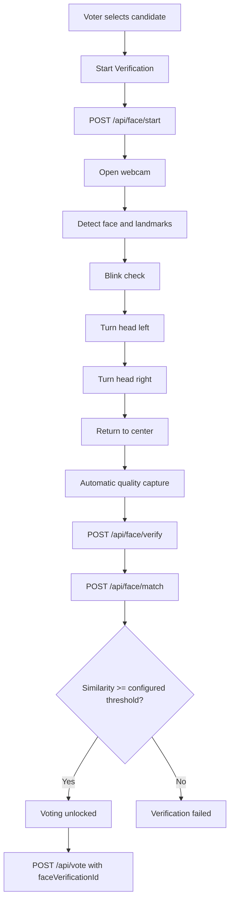

# Advanced Live Face Verification

## Verification Flow



## Camera Flow

The voting wizard now renders `src/pages/FaceVerification.tsx` during the biometric challenge step. The page opens the webcam with `navigator.mediaDevices.getUserMedia`, loads the TensorFlow facemesh detector, and continuously checks face position, landmarks, lighting, distance, sharpness, and movement stability.

Camera resources are stopped when the voter leaves the page, completes verification, or hits a failure state.

## Liveness Checks

The live sequence requires all of these signals before automatic capture:

- Exactly one face is visible.
- Left eye, right eye, nose, and mouth are detected.
- Face is centered and at an acceptable distance.
- Lighting and sharpness are acceptable.
- Position is stable.
- Blink is detected.
- Head turn left is detected.
- Head turn right is detected.
- Voter returns to center.

Ear visibility is displayed when available, but the voting liveness gate does not fail solely because an ear is hidden.

## Face Matching

The frontend derives a numeric face template from facemesh landmarks, pose, quality, and liveness values. The backend performs the final decision in `services/faceVerification.service.ts`.

The server compares the live template with the latest verified registered template for the user using a weighted cosine and distance score. The threshold is configurable with:

```bash
FACE_MATCH_THRESHOLD=0.82
```

The threshold should be calibrated with real enrollment and live verification samples before production use.

## API

- `POST /api/face/start`
  Starts an authenticated verification session and logs camera-opened audit activity.

- `POST /api/face/verify`
  Validates server-side liveness and quality metadata for a session.

- `POST /api/face/match`
  Validates liveness again, compares the live face template to the registered template, stores the verification result, and returns the similarity score.

- `GET /api/face/status?electionId=...`
  Returns the latest usable verification status for the authenticated voter.

- `POST /api/vote`
  Requires `faceVerificationId`, `electionId`, `candidateId`, and `fingerprintImage`. The vote endpoint rejects ballots when face verification is missing, failed, expired, already consumed, or for a different election.

## Folder Structure

```text
controllers/faceVerification.controller.ts
services/faceVerification.service.ts
routes/faceVerification.routes.ts
middleware/verifyFace.ts
validators/faceVerification.validator.ts
src/pages/FaceVerification.tsx
src/components/face-verification/
```

## Audit Logs

The system logs:

- Camera opened.
- Liveness completed or failed.
- Face verification passed or failed.
- Voting rejected when face verification is missing or expired.
- Voting allowed when the ballot is cast.

## Testing Guide

1. Run `npm run dev`.
2. Sign in as a verified voter.
3. Select an active election and candidate.
4. Start live face verification.
5. Confirm the UI guides through blink, left turn, right turn, and center return.
6. Confirm capture happens automatically.
7. Confirm voting is disabled until verification succeeds.
8. Submit fingerprint confirmation and cast the ballot.
9. Confirm `/api/vote` rejects requests without a valid `faceVerificationId`.

Verification commands used during implementation:

```bash
npx tsc --noEmit
npm run build
```
