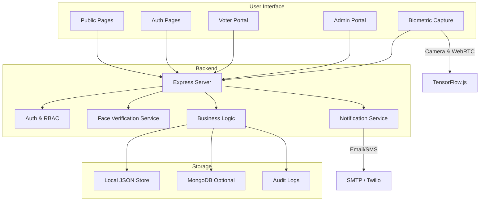

# VoTex System Architecture

## Overview

VoTex is a full-stack secure voting demo with a React/Vite frontend, an Express backend, and local JSON/MongoDB persistence. Biometric capture is performed in the browser, while authentication, ballot handling, and admin workflows are managed by the server.

## Architecture Illustration


> Replace the placeholder image above with a project-specific architecture diagram or screenshot once available.

## Architecture Diagram

```mermaid
flowchart LR
  subgraph Client[Browser Client]
    A[Public Landing]
    B[Login / Register]
    C[Voter Dashboard]
    D[Admin Panel]
    E[Biometric Scanner]
  endcls
  

  subgraph Frontend[React SPA]
    A -->|HTTP / API| Server
    B -->|HTTP / API| Server
    C -->|HTTP / API| Server
    D -->|HTTP / API| Server
    E -->|Local Live Capture| LocalBiometrics
  end

  subgraph LocalBiometrics[Browser Biometric Engine]
    LocalBiometrics[TensorFlow.js + Face Landmark Detector]
  end

  subgraph ServerApp[Express API Server]
    Server[server.ts]
    Auth[JWT Auth + RBAC]
    Validate[Zod Validation]
    Security[Helmet / CORS / Rate Limit]
    FaceApi[Face Verification Service]
    Data[Database Service]
    Dispatch[Email/SMS Dispatcher]
  end

  Server --> Auth
  Server --> Validate
  Server --> Security
  Server --> FaceApi
  Server --> Data
  Server --> Dispatch

  subgraph Storage[Persistence]
    JSON[Local JSON files in src/db/data]
    Mongo[Optional MongoDB]
  end

  Data --> JSON
  Data --> Mongo

  subgraph External[External Services]
    SMTP[SMTP Mail]
    SMS[Twilio SMS]
  end

  Dispatch --> SMTP
  Dispatch --> SMS

  Browser -->|Camera / WebRTC| LocalBiometrics
```

## Block Diagram



## Key components

- **Client**
  - `src/App.tsx`: main app shell, route selection, token/session management
  - Public and authenticated pages for voters, admins, candidates
  - `src/components/FaceVerification` and `src/components/BiometricScanner.tsx`

- **Server**
  - `server.ts`: Express app, middleware, route registration, security guard rails
  - `middleware/verifyFace.ts`: face verification request middleware
  - `routes/faceVerification.routes.ts`: biometric route endpoints
  - `services/faceVerification.service.ts`: biometric verification logic

- **Data layer**
  - `src/db/dbService.ts`: persistence abstraction, JSON data store, JWT helper, audit logs
  - `src/db/data/`: local seed and runtime storage for users, votes, profiles, OTPs, face verifications, audit logs, etc.

- **Biometric capture**
  - `@tensorflow-models/face-landmarks-detection` + `@tensorflow/tfjs-backend-webgl`
  - local model files in `src/model/face-api.js`
  - client-side face detection and landmarks analysis before submission

- **Security**
  - Helmet for HTTP security headers
  - CORS allowlist enforcement
  - route-level rate limiting for auth and OTP endpoints
  - JWT-based authentication and role middleware

- **Notifications**
  - Email: `nodemailer`
  - SMS: `twilio`
  - In-app dispatch logs for activity and alerts

## Deployment Notes

- Dev startup: `npm install && npm run dev`
- Production build: `npm run build && npm start`
- Production requires environment variables such as `BALLOT_ENCRYPTION_SECRET` and `VOTE_HMAC_SECRET`
- Local JSON storage is currently the default persistence layer; MongoDB is optional if configured
